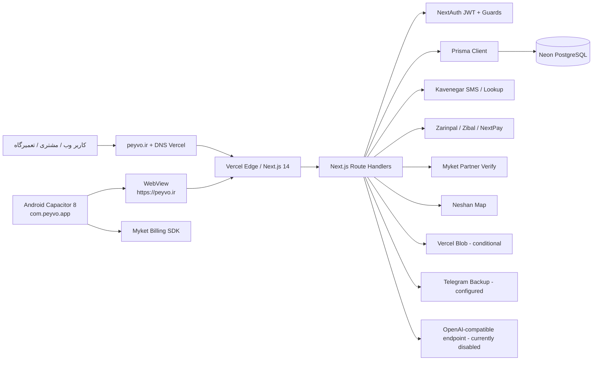
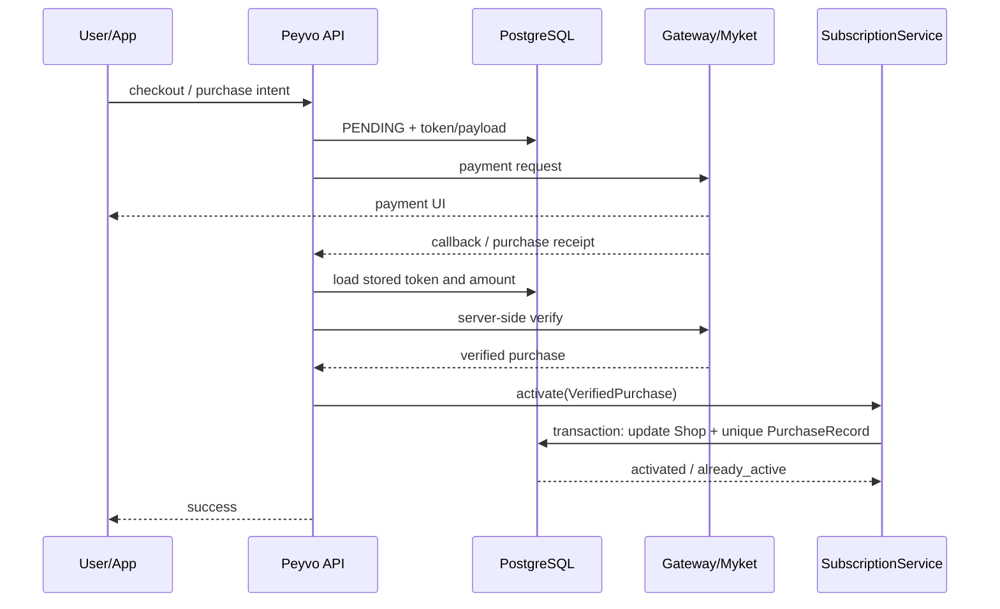
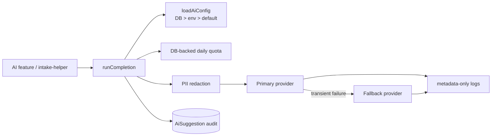

# PEYVO - راهنمای عملیات، زیرساخت و تداوم کسب‌وکار

<div dir="rtl">

**پروژه:** Peyvo (پیوو)  
**نوع سند:** Operational, Infrastructure & Business Continuity Handbook  
**نسخه سند:** 1.0  
**تاریخ تولید:** ۱۴۰۵/۰۵/۲۷ (2026-08-18)  
**آخرین بازبینی:** 2026-08-18 00:30 Asia/Tehran  
**Commit بررسی‌شده:** `c6893bcdf90d815049cc5b8b82f66af0b09832c0`  
**مخزن:** `behnam391/repair-saas-final`  
**دامنه عملیاتی:** `https://peyvo.ir`  
**شناسه استقرار Vercel:** `NOT VERIFIED` (هدر Vercel مشاهده شد، ولی شناسه Deployment از داشبورد در دسترس نبود)

> **طبقه‌بندی امنیتی: محرمانه عملیاتی - بدون رمز و کلید.** این سند عمداً هیچ گذرواژه، API Key، Token، Private Key، Merchant ID، Connection String یا کلید امضای اندروید ندارد. نسخه چاپی باید در محل امن نگهداری شود.

## راهنمای وضعیت شواهد

- **تأییدشده (VERIFIED):** مستقیماً از کد، schema، migration، پاسخ عمومی سرویس، DNS یا خواندن امن تنظیمات بررسی شده است.
- **استنباط‌شده (INFERRED):** نتیجه منطقی از شواهد است، اما داشبورد مالک سرویس مشاهده نشده است.
- **تأییدنشده (NOT VERIFIED):** برای تأیید به حساب مالک، داشبورد بیرونی یا سند قراردادی نیاز دارد.
- **اقدام انسانی (HUMAN ACTION):** فقط مالک حساب یا اپراتور مورد اعتماد می‌تواند انجام دهد.

---

# 1. خلاصه مدیریتی

پیوو یک سامانه SaaS چندمستأجری برای مدیریت تعمیرگاه و فروشگاه موبایل است. محصول، پذیرش دستگاه، مشتریان، گردش تعمیر، تکنسین‌ها، موجودی، فاکتور و پرداخت، همکاری بین مغازه‌ها، پیامک، کیف پول/اشتراک، پنل مشتری و اپ اندروید را در یک سامانه وب متمرکز می‌کند.

| موضوع | وضعیت | شواهد |
|---|---|---|
| کاربران هدف | تعمیرگاه‌های موبایل، فروشندگان/همکاران، کارکنان و مشتریان | VERIFIED از مدل‌ها و صفحات |
| مدل کسب‌وکار | پلن رایگان، حرفه‌ای و تجاری؛ خرید مدت‌دار و کد هدیه | VERIFIED از `lib/plans.ts` و billing |
| وب عمومی | `https://peyvo.ir` با HTTPS و پاسخ 200 | VERIFIED در 2026-08-18 |
| میزبانی | Next.js روی Vercel | VERIFIED از هدر `Server: Vercel` و مخزن |
| دیتابیس | PostgreSQL با Prisma؛ اتصال محلی به Neon مشاهده شد | VERIFIED / نام پروژه و Region: NOT VERIFIED |
| اندروید | Capacitor 8، شناسه `com.peyvo.app`، نسخه 1.2 / code 3 | VERIFIED |
| توزیع اندروید | APK مستقیم در GitHub Release؛ وضعیت انتشار نهایی بازار/مایکت تأیید نشده | VERIFIED / NOT VERIFIED |
| پرداخت وب | Zarinpal فعال؛ abstraction برای Zibal و NextPay | VERIFIED از تنظیمات امن و کد |
| پرداخت مایکت | SDK و verify سروری پیاده‌سازی شده؛ کلیدها تنظیم‌اند؛ پذیرش فروشگاه و خرید واقعی تأیید نشده | VERIFIED / NOT VERIFIED |
| پرداخت بازار | فقط فیلدهای تنظیمات وجود دارد؛ provider/SDK واقعی بازار پیاده نشده | VERIFIED - unfinished |
| پیامک | Kavenegar و Lookup فعال/تنظیم‌شده | VERIFIED از تنظیمات امن؛ تحویل واقعی دوره‌ای نیازمند پایش |
| AI | معماری provider-agnostic وجود دارد؛ وضعیت تولیدی فعلی خاموش/disabled | VERIFIED |
| بکاپ | Cron روزانه JSON به Telegram در کد و تنظیمات وجود دارد | VERIFIED؛ موفقیت روزانه/retention: NOT VERIFIED |

**آماده تولید:** وب، احراز هویت نقش‌محور، گردش تعمیر، فاکتور، پرداخت وب، پیامک، اندروید WebView، ثبت خطا، مهاجرت‌های Prisma.  
**آزمایشی/ناتمام:** AI واقعی خاموش است؛ بازار فاقد خرید درون‌برنامه‌ای است؛ مایکت بدون تأیید خرید واقعی؛ بازیابی خودکار و مانیتورینگ بیرونی اثبات نشده‌اند.  
**محدودیت اصلی:** تداوم سرویس به چند حساب شخصی، اجرای صحیح بکاپ و نگهداری کلید امضای اندروید وابسته است.

---

# 2. معماری کامل سامانه

## 2.1 نمودار A - معماری کلان



## 2.2 اجزای اصلی

| جزء | هدف/Provider | وابستگی | اثر خرابی | بازیابی/جایگزین |
|---|---|---|---|---|
| دامنه `peyvo.ir` | ورودی عمومی | DNS روی Vercel | قطع کامل دسترسی و callback | بازیابی مالک دامنه، اصلاح NS/A |
| Vercel | میزبانی Next.js و Cron | GitHub و env | سایت/API از دسترس خارج | rollback deployment یا provider جایگزین |
| Next.js 14.2.5 | UI و API | Node، env، DB | اختلال محصول | build از commit سالم |
| Prisma 5.20 | ORM و migration | `DATABASE_URL` | APIهای داده‌ای متوقف | generate/migrate deploy |
| Neon PostgreSQL | داده عملیاتی | اتصال شبکه و credential | تقریباً کل محصول متوقف | PITR/provider backup یا restore dump |
| Capacitor 8.4.2 | پوسته Android | دامنه پیوو | اپ بدون وب عملاً بلااستفاده | انتشار APK جدید یا تغییر server URL و rebuild |
| Kavenegar | OTP و پیام‌های پذیرش/آمادگی | API key/template | ورود/بازیابی یا اعلان مختل | Lookup/free-form، provider جایگزین |
| Payment gateways | پرداخت وب | Merchant/API credentials | خرید/شارژ/پرداخت فاکتور مختل | تغییر provider از تنظیمات، reconciliation |
| Myket | پرداخت درون‌برنامه‌ای | SDK + RSA + access token | خرید اشتراک در APK مایکت مختل | وب فقط خارج از build فروشگاهی؛ رفع config/SDK |
| Neshan | نقشه | web API key | انتخاب موقعیت/نقشه مختل | ورود دستی مختصات یا provider جایگزین |
| Vercel Blob | تصاویر عمومی | Blob token | آپلود تصویر در تولید شکست می‌خورد | Blob جدید یا object storage دیگر |
| Telegram | مقصد بکاپ JSON | bot token/chat | بکاپ زمان‌بندی‌شده تحویل نمی‌شود | دانلود دستی امن + storage رمزگذاری‌شده |
| AI endpoint | پیشنهاد پذیرش | API key/base URL | فقط AI helper مختل، نه جریان اصلی | خاموش‌سازی/fallback/mock |

**Region:** محل دقیق Neon، Vercel project و data residency در داشبوردها `NOT VERIFIED` است. هدر درخواست، Vercel را تأیید می‌کند ولی برای تصمیم حقوقی/داده‌ای کافی نیست.

---

# 3. موجودی زیرساخت

| سرویس | هدف | مالک/شناسه | URL مدیریت/تولید | تنظیم مهم | محل Credential | بازیابی | اهمیت |
|---|---|---|---|---|---|---|---|
| GitHub | سورس و تاریخچه | Owner: `behnam391` (VERIFIED) | github.com / repo above | branch `main` | Git credential manager / 2FA | recovery codes + مالک پشتیبان | Critical |
| Vercel | deploy، domain، cron | Project/Team `NOT VERIFIED` | vercel.com / peyvo.ir | env، Git integration، Cron | Vercel encrypted env | account recovery + import repo | Critical |
| دامنه IR | مالکیت `peyvo.ir` | Registrar/holder `NOT VERIFIED` | nic.ir / registrar unknown | NS: Vercel DNS | registrar account | recovery email/phone | Critical |
| DNS | resolution | Vercel DNS | Vercel Domains | `ns1/ns2.vercel-dns.com` | Vercel account | recreate records | Critical |
| Neon PostgreSQL | DB | Project/region `NOT VERIFIED` | console.neon.tech | connection string | Vercel env + secure local env | Neon PITR/export | Critical |
| Vercel Blob | تصاویر | status `NOT VERIFIED` | Vercel Storage | `BLOB_READ_WRITE_TOKEN` | Vercel env | reconnect/create store | High |
| Kavenegar | SMS/OTP | account owner `NOT VERIFIED` | panel.kavenegar.com | sender, Lookup templates | encrypted PlatformSettings / env fallback | rotate key/templates | High |
| Zarinpal | gateway فعال | merchant owner `NOT VERIFIED` | zarinpal.com | registered callback domain | encrypted PlatformSettings / env | rotate merchant credential | Critical |
| Zibal/NextPay | gateway جایگزین | not configured | provider panels | provider switch | encrypted settings/env | configure when required | Medium |
| Neshan | map | owner `NOT VERIFIED` | platform.neshan.org | domain-restricted web key | PlatformSettings | rotate/restrict | Medium |
| Myket | Android billing | developer account `NOT VERIFIED` | developer.myket.ir | package, products, access token | encrypted settings/env | account recovery + rotate token | High |
| Cafe Bazaar | store future billing | developer account `NOT VERIFIED` | developers.cafebazaar.ir | package/products | encrypted settings | implement provider then release | High |
| Telegram | backup destination | bot/chat owner `NOT VERIFIED` | Telegram | bot + private chat/channel | encrypted settings | new bot/chat + test | Critical |
| SMTP | email recovery | provider `NOT VERIFIED` | host hidden | host/user/from | password encrypted; metadata DB | rotate/retest | Medium |
| AI provider | optional AI | provider `NOT VERIFIED` | configured base URL hidden | primary/fallback/model | encrypted settings/env | disable/rotate/switch | Low now |
| GitHub Release | APK مستقیم | repo owner | release `v1.2.0` | immutable artifact discipline | GitHub account | re-upload signed artifact | High |
| ErrorLog | self-hosted monitoring | Peyvo DB | Super Admin errors | no external alerting | DB | inspect/resolve/export | Medium |

Cronهای تأییدشده در `vercel.json`: یادآوری اشتراک هر روز 06:00 UTC و بکاپ هر روز 03:00 UTC. هر دو به `CRON_SECRET` وابسته‌اند.

---

# 4. نقشه دسترسی و مالکیت

| دارایی | مالک اصلی | مالک بازیابی | 2FA | ریسک تک‌نفره |
|---|---|---|---|---|
| GitHub | حساب `behnam391` | NOT VERIFIED | باید فعال باشد | **High** تا تعیین پشتیبان |
| Vercel | NOT VERIFIED | NOT VERIFIED | الزامی پیشنهادی | **Critical** |
| دامنه/NIC | NOT VERIFIED | NOT VERIFIED | recovery phone/email | **Critical** |
| Neon | NOT VERIFIED | NOT VERIFIED | الزامی پیشنهادی | **Critical** |
| Zarinpal/Kavenegar | NOT VERIFIED | NOT VERIFIED | الزامی پیشنهادی | High |
| Myket/Bazaar | بهنام شفیعی از مکاتبه قبلی - INFERRED | NOT VERIFIED | الزامی | High |
| Telegram backup | NOT VERIFIED | حداقل دو admin | الزامی | Critical |
| Android signing key | نگهدارنده محلی `NOT VERIFIED` | نسخه رمزگذاری‌شده آفلاین | N/A | **Critical** |

**قاعده عملیاتی:** برای تمام موارد Critical، دو فرد مورد اعتماد، recovery email مستقل، شماره بازیابی به‌روز و recovery code آفلاین لازم است. هیچ مدرکی از دسترسی پشتیبان در repository وجود ندارد؛ بنابراین همه موارد فوق تا تأیید مالک، single-person dependency محسوب می‌شوند.

---

# 5. فرایند استقرار Production

## 5.1 مسیر استاندارد

```text
تغییر کد -> npm run check -> بررسی migration -> git commit -> git push origin main
-> Vercel build -> prisma generate -> prisma migrate deploy -> next build
-> deployment -> smoke test روی peyvo.ir
```

| دستور | زمان اجرا | کار | شکست محتمل | تأیید موفقیت |
|---|---|---|---|---|
| `npm ci` | clone/CI | نصب دقیق lockfile | نسخه Node/registry | exit 0 |
| `npm run dev` | توسعه محلی | Next dev | env/DB/port | بازشدن localhost |
| `npm run check` | قبل commit | TypeScript + 40 test | type/test regression | همه tests pass |
| `npm run typecheck` | قبل commit | `tsc --noEmit` | type mismatch | exit 0 |
| `npm test` | قبل commit | تست‌های AI/security/subscription | env ناخواسته یا regression | 40/40 pass در این بررسی |
| `npm run build` | Vercel/آزمون کنترل‌شده | generate + migrate deploy + Next build | DB unavailable/migration خطا | build success + migrations applied |
| `npm run db:deploy` | migration production | migrate deploy | drift/lock/connection | Prisma success و schema check |
| `npm run prisma:migrate -- --name NAME` | فقط dev DB | ساخت migration | اتصال اشتباه به prod | فایل SQL review شود |
| `npm run android:sync` | قبل build Android | sync Capacitor | dependency/webDir | Gradle project updated |
| `cd android; .\gradlew.bat assembleRelease` | APK release | build release | JDK/signing/SDK | APK و signature verification |

**Lint:** script مستقل lint در `package.json` وجود ندارد - `NOT IMPLEMENTED`.

## 5.2 کنترل migration

Build فعلی `prisma migrate deploy` را اجرا می‌کند؛ این از `db push` امن‌تر است، اما deployment به دسترسی write دیتابیس وابسته است. قبل از push:

1. SQL migration را بخوانید؛ `DROP`, `TRUNCATE`, تغییر nullable/type و index بزرگ را علامت‌گذاری کنید.
2. روی clone/staging restore شده تست کنید.
3. بکاپ قابل بازیابی و timestamp آن را ثبت کنید.
4. سپس deploy کنید.

## 5.3 Rollback

- کد: در Vercel، deployment سالم قبلی را Promote/Rollback کنید یا commit اصلاحی بسازید.
- دیتابیس: rollback کد لزوماً migration را برنمی‌گرداند. migration برگشتی جداگانه یا PITR لازم است.
- هرگز `git reset --hard` یا `prisma db push` روی production به‌عنوان روش اضطراری استفاده نشود.

---

# 6. مستندات دیتابیس

**Provider:** PostgreSQL، Prisma datasource با `DATABASE_URL`.  
**معماری:** یک دیتابیس مشترک چندمستأجری؛ اکثر جدول‌های کسب‌وکاری `shopId` دارند. جداسازی در لایه برنامه با `requireSession()` و شرط `where: { shopId }` انجام می‌شود.

## 6.1 گروه مدل‌ها

| حوزه | مدل‌های کلیدی |
|---|---|
| هویت/مالکیت | Shop, User, PlatformAdmin, PlatformCustomer, Customer |
| تعمیر | Ticket, TicketHistory, TicketMessage, PendingIntake, ReturnRecord |
| مالی | Invoice, InvoiceItem, Subscription, PurchaseRecord, WalletTransaction, Expense, GiftCode |
| موجودی/فروش | InventoryItem, TicketPart, DealerInventory, MarketListing |
| همکاری | ShopPartnership, ShopReferral, Conversation, Message |
| امنیت/ممیزی | ImpersonationToken, PasscodeAccessLog, AiConfigAudit, ErrorLog, RateLimitBucket |
| AI | AiSuggestion, PlatformSettings AI fields |
| خارجی | ExternalApiKey, DeviceFlag, DeviceTransaction, Rating |

## 6.2 جداول بحرانی

- `Shop`: entitlement، plan، quota، فعال‌بودن و مانده کیف پول.
- `User`, `PlatformAdmin`, `PlatformCustomer`: password hash و هویت.
- `Ticket`, `Customer`, `Invoice`: عملیات روزانه و تعهد مالی.
- `Subscription`, `PurchaseRecord`, `WalletTransaction`: اثبات پرداخت و entitlement.
- `PlatformSettings`: تنظیمات و ciphertext سرویس‌های حیاتی.
- `Ticket.devicePasscode`: رمز دستگاه رمزگذاری‌شده؛ به master key وابسته.

## 6.3 جداسازی Tenant

**VERIFIED:** JWT کاربر مغازه `shopId` و role دارد؛ `requireSession` جلسات مشتری/سوپرادمین را رد می‌کند؛ guardهای Desk/Capability برای عملیات مالی وجود دارد.  
**ریسک:** هیچ RLS/Policy در migrationها یافت نشد. بنابراین حفاظت کاملاً application-level است و یک route بدون `shopId` می‌تواند نشت بین مستأجرها ایجاد کند.  
**اقدام:** تست خودکار tenant-boundary برای همه routeها و سپس RLS دفاعی PostgreSQL یا repository layer اجباری.

## 6.4 داده حساس در حالت سکون

- passwordها با bcrypt cost 10 hash می‌شوند.
- device passcode و secretهای PlatformSettings با AES-256-GCM و `SECRETS_MASTER_KEY` رمز می‌شوند؛ ولی helper در نبود master key plaintext passthrough دارد.
- `ExternalApiKey.apiKey` به‌صورت plaintext قابل lookup و از API سوپرادمین قابل برگشت است - ریسک High؛ بهتر است hash + prefix/last4 ذخیره شود.
- PurchaseRecord.raw تا 4000 کاراکتر payload provider نگهداری می‌کند؛ باید داده شخصی/رسید حداقلی بماند.

---

# 7. بکاپ و بازیابی بحران

## 7.1 وضعیت فعلی

**VERIFIED:** Cron روزانه `/api/cron/backup`، snapshot کامل JSON مورد انتظار و ارسال به Telegram تنظیم شده است؛ دانلود دستی و restore non-destructive در پنل سوپرادمین وجود دارد.  
**NOT VERIFIED:** آخرین اجرای موفق، retention، رمزگذاری فایل در مقصد، سلامت bot/chat، PITR و retention پلن Neon.

> **هشدار بحرانی:** `BACKUP_MODELS` و `RESTORE_ORDER` با schema فعلی همگام نیستند. حداقل `PurchaseRecord`, `AiSuggestion`, `AiConfigAudit`, `PasscodeAccessLog` و `RateLimitBucket` در snapshot/restore فعلی پوشش کامل ندارند. بنابراین عبارت «full backup» در comment کد دقیق نیست.

نکته دوم: مسیر POST تست دستی بکاپ، token ذخیره‌شده را قبل ارسال decrypt نمی‌کند، درحالی‌که cron این کار را می‌کند. تست دستی ممکن است با credential رمز‌شده شکست بخورد.

## 7.2 حداقل راهبرد پیشنهادی

1. بکاپ provider-native/PITR Neon را فعال و retention را مستند کنید.
2. روزانه `pg_dump` رمزگذاری‌شده در object storage مستقل با retention 30 روز.
3. snapshot برنامه‌ای را با schema sync و schemaVersion ارتقا دهید.
4. فایل Telegram را نسخه دوم، نه تنها نسخه بکاپ بدانید.
5. ماهانه restore روی دیتابیس جداگانه و smoke test انجام دهید.
6. RPO هدف: 24 ساعت حداقل؛ با PITR بهتر، 5-15 دقیقه. RTO هدف: 2-4 ساعت.

## 7.3 دستورهای امن نمونه

```powershell
# فقط با URL دیتابیس مقصد تستی و در shell امن
pg_dump --format=custom --no-owner --file peyvo-YYYYMMDD.dump $env:DATABASE_URL
pg_restore --list peyvo-YYYYMMDD.dump
pg_restore --clean --if-exists --no-owner --dbname $env:TEST_DATABASE_URL peyvo-YYYYMMDD.dump
```

Connection string را در command history، chat یا PDF قرار ندهید. اگر Neon unavailable شد، DNS/connection را بررسی، maintenance banner فعال، writeها را متوقف، سپس از آخرین dump/PITR به PostgreSQL جایگزین restore و `DATABASE_URL` را در Vercel تغییر دهید.

---

# 8. فهرست امن Environment Variableها

| نام | هدف | Production | محل معمول | نبودن چه چیزی را می‌شکند | Rotation |
|---|---|---|---|---|---|
| `DATABASE_URL` | اتصال Prisma/Postgres | Required | Vercel env | تقریباً کل API/build | credential جدید DB، update env، redeploy |
| `NEXTAUTH_SECRET` | امضای JWT/cookie | Required | Vercel env | session/auth ناامن یا خراب | مقدار جدید؛ همه sessionها logout |
| `NEXTAUTH_URL` | canonical auth URL | Recommended | Vercel env | redirect/callback | روی `https://peyvo.ir` تنظیم |
| `OTP_HASH_SECRET` | HMAC کد OTP | Recommended | Vercel env | OTP جاری نامعتبر؛ fallback NextAuth | rotate، OTPهای جاری expire |
| `SECRETS_MASTER_KEY` | decrypt secretهای DB | Critical | Vercel env + escrow | SMS/payment/AI و passcode unreadable | ابتدا re-encrypt با old->new؛ هرگز مستقیم عوض نشود |
| `CRON_SECRET` | حفاظت cron | Required | Vercel env | cron unauthorized/fail | rotate و sync Vercel Cron |
| `PUBLIC_APP_URL` | callback/QR/SMS domain | Required | Vercel env | URL اشتباه/Vercel URL | `https://peyvo.ir` |
| `NEXT_PUBLIC_APP_URL` | لینک client | Recommended | Vercel env | برخی لینک‌ها | redeploy پس از تغییر |
| `BLOB_READ_WRITE_TOKEN` | upload تصاویر | Required if uploads | Vercel env | upload production 503 | rotate در Blob و reconnect |
| `KAVENEGAR_API_KEY` | fallback SMS | Conditional | Vercel env | SMS اگر DB خالی | rotate provider/settings |
| `KAVENEGAR_SENDER` | sender SMS | Conditional | Vercel env | ارسال آزاد | replace approved sender |
| `ZARINPAL_MERCHANT_ID` | fallback payment | Conditional | Vercel env | پرداخت اگر DB خالی | rotate/re-register callbacks |
| `ZIBAL_MERCHANT` / `NEXTPAY_API_KEY` | gateway جایگزین | Optional | Vercel env | provider مربوط | rotate provider |
| `PAYMENT_PROVIDER` | provider fallback | Optional | Vercel env | default Zarinpal | switch بعد test |
| `MYKET_PACKAGE_NAME` | package verify | Required Myket | Vercel env/default | verify mismatch | معمولاً ثابت |
| `MYKET_RSA_PUBLIC_KEY` | SDK public key fallback | Required Myket | settings/env | setup billing | replace from console/build |
| `MYKET_ACCESS_TOKEN` | server verify | Required Myket | settings/env | verify purchase | revoke/issue token |
| `AI_*` | provider/model/quota | Optional | settings/env | فقط AI | disable، rotate keys، test probe |
| `PEYVO_KEYSTORE_*` | Android signing local/CI | Required release | secret manager local/CI | signed release | keystore normally cannot be replaced without store process |

**وضعیت محلی مشاهده‌شده:** فقط `DATABASE_URL` در محیط محلی set بود؛ این درباره Vercel چیزی را اثبات نمی‌کند. secretهای سرویس در PlatformSettings وجود دارند و با وجود master key باید encrypted باشند؛ وضعیت `SECRETS_MASTER_KEY` در Vercel `NOT VERIFIED` است.

---

# 9. معماری امنیت

## 9.1 کنترل‌های موجود

- NextAuth Credentials با JWT؛ چهار provider جدا: shop، super-admin، customer، impersonation.
- bcrypt برای password؛ OTP پنج رقمی با HMAC و timing-safe comparison.
- guardهای `requireSession`, `requireDeskSession`, `requireSuperAdmin`, `requireCustomer`, `requireCapability`.
- revalidation session برای user/shop/customer غیرفعال.
- impersonation یک‌بارمصرف، 10 دقیقه‌ای و وابسته به consent مغازه.
- AES-256-GCM برای secretهای DB و passcode دستگاه؛ ممیزی reveal passcode.
- payment token matching + server verify + transaction/idempotency.
- rate limit توزیع‌شده DB برای 13 نقطه؛ upload محدود و signature فایل بررسی می‌شود.
- security headers: HSTS از Vercel، X-Frame-Options DENY، nosniff، Referrer و Permissions Policy.
- AI redaction و log بدون محتوا.

## 9.2 ریسک‌های شناسایی‌شده

| شدت | ریسک | محدوده | کنترل فعلی | اقدام/اولویت |
|---|---|---|---|---|
| Critical | بکاپ ناقص نسبت به schema | DR | Telegram + manual backup | sync model list + provider backup - P0 |
| Critical | تک‌نفره بودن مالکیت حساب‌ها/signing key | continuity | نامشخص | owner map + escrow + backup admins - P0 |
| High | tenant isolation فقط application-level | همه داده مغازه‌ها | guardها و `shopId` | test coverage + RLS - P1 |
| High | `SECRETS_MASTER_KEY` تولیدی تأیید نشده؛ plaintext fallback | settings/passcodes | AES helper | verify key و encrypt backfill - P0 |
| High | External API key plaintext و API GET آن را برمی‌گرداند | external integrations | superadmin guard/scopes | hash keys، one-time display - P1 |
| High | API key نقشه از endpoint عمومی قابل دریافت است | Neshan quota/billing | public web key | domain restriction + rotation؛ endpoint حداقلی - P1 |
| High | API کلید Kavenegar قبلاً در مکالمه انسانی افشا شده | SMS | encrypted DB | فوراً rotate و revoke قدیمی - P0 |
| Medium | فقط 13 استفاده rate limit در 121 route؛ login guard صریح دیده نشد | abuse/auth | برخی OTP/upload/log routes | rate-limit login و public mutations - P1 |
| Medium | monitoring فقط DB/log کنسول، alert بیرونی اثبات نشده | عملیات | ErrorLog | uptime + Sentry/alerts - P1 |
| Medium | `android:allowBackup=true` | Android | WebView/session dependent | threat review؛ disable یا backup rules - P2 |
| Medium | backup JSON شامل hashها و PII است | privacy | HTTPS/superadmin | encrypt at rest + access retention - P1 |
| Medium | کلیدهای عمومی Bazaar در secret list رمز می‌شوند ولی billing واقعی نیست | release | settings only | از «configured» با «implemented» تفکیک - P2 |

اسکن مخزن و تاریخچه، private key یا Kavenegar key شناخته‌شده را پیدا نکرد. URLهای PostgreSQL یافته‌شده placeholder/documentation بودند. این اسکن جایگزین ابزار تخصصی secret scanning در CI نیست.

---

# 10. پرداخت و اشتراک

## 10.1 نمودار B - پرداخت تا entitlement



## 10.2 وب، کیف پول و فاکتور

- provider فعال: Zarinpal؛ Zibal و NextPay در abstraction موجودند.
- checkout اشتراک فقط OWNER؛ مبلغ از pricing سرور گرفته می‌شود.
- پرداخت از کیف پول در transaction، Subscription و WalletTransaction و Shop را به‌روز می‌کند.
- gateway callback بدون session است ولی token ذخیره‌شده را match و از provider verify می‌کند.
- `PurchaseRecord.externalRef` unique و mutation از `SubscriptionService` انجام می‌شود.
- فاکتور مشتری مانده مبلغ را پرداخت می‌کند؛ callback مقدار pending را verify و paidAmount را transactionally افزایش می‌دهد.
- GiftCode یک‌بارمصرف و اتمیک است.
- cancellation در SubscriptionService auto-renew را متوقف و entitlement را تا expiry حفظ می‌کند.
- refund خودکار provider برای subscription مشاهده نشد؛ `ReturnRecord` مربوط به عملیات فروشگاه است. refund/reconciliation مالی فروشگاه‌ها `NOT IMPLEMENTED/NOT VERIFIED`.

## 10.3 سناریوهای شکست

| سناریو | رفتار فعلی | اقدام عملیاتی |
|---|---|---|
| callback تکراری | Subscription PAID short-circuit + PurchaseRecord unique | log و عدم تمدید دوباره |
| پرداخت موفق، callback fail | ErrorLog ثبت می‌شود؛ entitlement ممکن است pending بماند | provider panel را با Subscription/PurchaseRecord تطبیق و callback/reconcile کنید |
| token دستکاری/دوباره‌استفاده | mismatch رد؛ externalRef idempotent | 400/error log، بررسی fraud |
| DB هنگام activation fail | transaction rollback | پس از DB recovery، verify/replay امن callback |
| provider unavailable | checkout/verify fail | پیام maintenance؛ switch provider فقط پس از test |
| wallet callback تکراری | updateMany claim + transaction | no double credit |

**Gap:** job خودکار reconciliation برای پرداخت‌های موفق ولی callback ازدست‌رفته یافت نشد. P1: ابزار superadmin برای re-verify PENDING بر اساس provider بسازید.

---

# 11. Cafe Bazaar و Myket

## 11.1 Myket

| مورد | وضعیت |
|---|---|
| package | `com.peyvo.app` - VERIFIED |
| SDK | `com.github.myketstore:myket-billing-client:1.19` - VERIFIED |
| Native plugin | purchase, restore, consume, availability - VERIFIED |
| Server verify | Myket partner endpoint با `X-Access-Token` - VERIFIED in code/tests |
| امنیت | payload تصادفی bind به shop/intent؛ SKU server-side؛ token client پذیرفته ولی access token فقط server | VERIFIED |
| SKU | هشت SKU `peyvo.{pro|business}.{1m|3m|6m|12m}`؛ comment می‌گوید placeholder تا تطبیق console | NEEDS CONFIRMATION |
| credential | RSA و access token در settings تنظیم‌شده‌اند | VERIFIED presence only |
| خرید واقعی/approval | NOT VERIFIED |
| restore | native query inventory و verify سمت سرور | IMPLEMENTED؛ end-to-end NOT VERIFIED |
| renewal/refund | autoRenew false؛ refund reconciliation route یافت نشد | NOT IMPLEMENTED |

Release: versionCode باید همیشه افزایش یابد، APK/AAB با همان signing key ساخته، روی device دارای Myket تست و سپس console submit شود. Review ممکن است پرداخت مستقیم بانکی داخل build فروشگاهی را رد کند؛ کد `isMyketAndroidApp()` وب‌گیت‌وی را در Android پنهان می‌کند.

## 11.2 Cafe Bazaar

- package و APK عمومی مشترک ممکن است استفاده شود، اما flavor مستقل Bazaar در Gradle وجود ندارد.
- فیلدهای RSA و dynamic discount در PlatformSettings و UI هستند.
- هیچ Bazaar Billing SDK، native plugin، provider verify یا route خرید بازار یافت نشد.
- بنابراین **خرید درون‌برنامه‌ای Bazaar ناتمام است** و صرف ذخیره کلید به معنی آمادگی نیست.
- restore/renew/cancel/refund بازار `NOT IMPLEMENTED`.

---

# 12. معماری Android / Capacitor

| مورد | مقدار تأییدشده |
|---|---|
| Capacitor | 8.4.2 |
| appId/package | `com.peyvo.app` |
| version | 1.2 / versionCode 3 |
| webDir | `android-shell` |
| server URL | `https://peyvo.ir`, cleartext false |
| min/target/compile SDK | از `android/variables.gradle` و root config؛ قبل release دوباره بررسی شود |
| Java | 17 |
| native plugins | MyketBilling, NativeContacts, AppVersion |
| permissions | INTERNET, FINE/COARSE LOCATION |
| build flavors | flavor مستقل وجود ندارد؛ یک build با Myket SDK |
| signing | envهای `PEYVO_KEYSTORE_*` یا Android Studio UI؛ credential خارج Git |
| update | API `/api/app-version` و banner؛ APK direct download |

## 12.1 ساخت‌ها

```powershell
npm ci
npm run check
npm run android:sync
cd android
.\gradlew.bat assembleDebug
.\gradlew.bat assembleRelease
```

- Development: `assembleDebug`، signing debug خودکار.
- Production/Myket: `assembleRelease` با env signing و versionCode جدید. سپس signature/package/version را با `apksigner`/`aapt` بررسی کنید.
- Bazaar build اختصاصی **واقعاً پیاده نشده**؛ تا افزودن Bazaar billing/flavor نمی‌توان دستور معتبر جداگانه ارائه کرد.
- چون اپ WebView به دامنه production متصل است، بسیاری تغییرات UI بدون APK جدید دیده می‌شوند؛ تغییر native plugin، permission، SDK یا version detector حتماً APK جدید می‌خواهد.

**ریسک signing key:** گم‌شدن keystore/password ممکن است امکان آپدیت همان package در store را از بین ببرد. یک نسخه رمزگذاری‌شده آفلاین، یک نسخه escrow نزد فرد دوم و دستور بازیابی مکتوب الزامی است.

---

# 13. معماری AI

## 13.1 نمودار C



- `lib/ai` abstraction شامل types، registry، config، quota، redaction، logger، probe و service است.
- providerها: disabled، mock و OpenAI-compatible `/chat/completions`.
- انتخاب provider از PlatformSettings، سپس env و default؛ business logic تغییر نمی‌کند.
- timeout، retry محدود برای خطاهای transient و fallback مستقل موجود است.
- quota در `RateLimitBucket` است و در outage fail-open می‌شود.
- metadata log می‌شود، نه prompt/response؛ AiSuggestion خروجی و inputSummary redacted را نگه می‌دارد.
- keyها در PlatformSettings رمز‌شده و به browser برگشت داده نمی‌شوند.
- وضعیت production هنگام بررسی: `aiEnabled=false`, provider `disabled`; key primary موجود ولی استفاده نمی‌شود.

تعویض provider: در Super Admin، AI را خاموش نگه دارید، provider/base URL/model/key را ثبت، Connection Test را اجرا، fallback و quota را تنظیم و سپس enable کنید. برای rollback فوراً `aiEnabled=false`.

---

# 14. قابلیت AI: دستیار پذیرش تعمیر

جریان: کاربر مجاز در ticket، مدل دستگاه + lane + شرح اولیه + damage notes را می‌فرستد؛ سرویس redaction انجام می‌دهد؛ خروجی JSON سه‌بخشی parse و با disclaimer نمایش می‌دهد.

**فیلدهای استفاده‌شده:** deviceModel، laneLabel، issueInitial، customerDamageNotes.  
**عمداً خارج:** نام، موبایل، ایمیل، IMEI، passcode، قیمت و اطلاعات پرداخت.  
**خروجی مجاز:** خلاصه، پرسش‌های پیشنهادی، توضیح قابل فهم برای مشتری.  
**غیرمجاز:** تشخیص قطعی، قیمت قطعی، تغییر ticket، تصمیم خودکار یا دستور تعمیر خطرناک.  
**شکست:** نتیجه safe-negative؛ جریان پذیرش ادامه می‌یابد.  
**Quota:** هر تلاش سهم روزانه shop را مصرف می‌کند؛ صفر یعنی بدون cap. Store outage باعث fail-open می‌شود.

---

# 15. پایش و عیب‌یابی

## 15.1 سایت Down

1. `https://peyvo.ir` و DNS/SSL را از شبکه دیگر تست کنید.
2. Vercel Status و آخرین deployment/log را ببینید.
3. health وابسته DB را با login یا route امن بررسی کنید.
4. DNS NS باید Vercel باشد؛ دامنه expiry را در NIC بررسی کنید.
5. deployment سالم قبلی را rollback و سپس علت را جداگانه رفع کنید.

## 15.2 Vercel deployment failed

- Build log را در مراحل `prisma generate`, `prisma migrate deploy`, `next build` تفکیک کنید.
- env presence را بدون چاپ مقدار کنترل کنید.
- migration ناموفق را در جدول `_prisma_migrations` و SQL همان فایل بررسی کنید.
- build را با دیتابیس staging بازتولید کنید؛ روی prod از `migrate dev` استفاده نکنید.

## 15.3 Database connection failed

- Neon status، project compute، connection limit، host/SSL و credential rotation را بررسی کنید.
- `lib/db.ts` و Vercel function logs؛ هیچ URL را paste نکنید.
- پس از restore، `npx prisma migrate status` و شمارش رکوردهای بحرانی را روی مقصد تستی انجام دهید.

## 15.4 Prisma migration failed

- فایل migration و error code؛ از edit migration اجراشده پرهیز کنید.
- migration جدید اصلاحی بسازید؛ در موارد partial با `prisma migrate resolve` فقط پس از audit.
- قبل هر تغییر، backup/PITR timestamp ثبت شود.

## 15.5 پرداخت موفق ولی اشتراک فعال نیست

- Super Admin ErrorLog با source payment و route callback.
- Subscription بر اساس id/status/authority و PurchaseRecord externalRef بررسی شود.
- provider panel مبلغ/ref را مقایسه؛ token را در ticket/chat نگذارید.
- verify مجدد کنترل‌شده و idempotent؛ تغییر دستی plan فقط با audit و مدرک پرداخت.

## 15.6 SMS ارسال نشد

- settings presence، Lookup enabled، نام دقیق template و sender را بررسی کنید.
- Kavenegar balance/status/rejected content؛ خطاهای `lib/sms.ts` در logs.
- OTP، intake و ready مسیرهای جدا دارند؛ ready در lookup بدون template عمداً error می‌دهد.

## 15.7 AI connection failed

- ابتدا `aiEnabled`, provider, base URL و model؛ سپس Super Admin AI test.
- error kind: auth/rate_limit/network/timeout/invalid_response.
- fallback و quota؛ در بحران AI را خاموش کنید، محصول اصلی باید کار کند.

## 15.8 Android app fails

- اینترنت، TLS و بازشدن peyvo.ir در browser؛ WebView/Chrome update.
- package/version/signature و Capacitor logs (`adb logcat`).
- Myket: نصب بودن Myket، public key، SDK setup، SKU/payload و server verify.

## 15.9 خرید Myket/Bazaar

- Myket: intent -> native receipt -> `/api/billing/myket/verify` -> PurchaseRecord -> consume.
- Bazaar: billing پیاده نشده؛ failure «تنظیمات» نیست، gap محصول است.

---

# 16. پاسخ به حادثه

| حادثه | نشانه | اقدام فوری/مهار | بازیابی و اعتبارسنجی |
|---|---|---|---|
| DB outage | login/API errors | freeze deploy، status provider | restore/PITR، counts، login/payment smoke |
| Vercel outage | 5xx/timeout | status، اطلاع‌رسانی | rollback یا provider جایگزین، DNS |
| DNS/domain | NXDOMAIN/cert | registrar lock/expiry/NS | restore Vercel NS، SSL 200 |
| Gateway outage | checkout/verify fail | disable CTA/maintenance، عدم تکرار کور | reconcile pending، provider switch tested |
| SMS outage | OTP/notification fail | status Kavenegar، alternate support | rotate key/template، test recipient |
| AI outage | helper unavailable | `aiEnabled=false` | test provider/fallback؛ core smoke |
| Credential leak | unauthorized usage | revoke/rotate فوراً، preserve logs | update env/settings، redeploy، audit |
| GitHub compromise | commits/releases ناشناس | revoke sessions/tokens، protect branch | restore trusted commit، rotate integrations |
| bad deployment | 5xx/regression | promote previous deployment | forward fix؛ DB compatibility check |
| DB corruption | missing rows/columns | stop writes، snapshot evidence | PITR to new DB، compare counts، switch URL |
| signing key loss | store update rejected | جست‌وجوی escrow، توقف ساخت با key جدید | store recovery process؛ احتمال package جدید |
| developer account loss | no release access | recovery email/2FA codes | transfer ownership/add backup admins |

در هر حادثه: زمان شروع، commander، scope، تصمیم‌ها، credential rotations، RPO/RTO و postmortem بدون secret ثبت شود.

---

# 17. چرخش Credentials

- **DB:** user/password جدید بسازید، Vercel env را تغییر، redeploy و smoke؛ سپس credential قبلی revoke.
- **NextAuth:** مقدار جدید همه JWTها را نامعتبر می‌کند؛ maintenance window و اطلاع logout.
- **OTP secret:** OTPهای باز نامعتبر می‌شوند؛ بعد از expiry window rotate.
- **SECRETS_MASTER_KEY:** مستقیم تعویض نکنید. با کلید قدیم همه ciphertextها را decrypt و با کلید جدید re-encrypt کنید؛ شامل PlatformSettings و Ticket passcode. نسخه امن کلید قدیم را تا verify نگه دارید. اگر بدون migration عوض شود، decrypt رشته خالی می‌دهد و سرویس‌ها/passcodeها ظاهراً «تنظیم‌نشده» می‌شوند.
- **Payment/SMS/AI/Myket:** ابتدا credential جدید، test، update encrypted settings/env، سپس revoke قدیمی و monitor.
- **Bazaar:** کلید public را طبق console replace؛ token/private material فقط server/secret manager.
- **Android signing:** rotation معمولی ممکن نیست؛ از store key-upgrade/recovery رسمی استفاده کنید. keystore را در Git یا PDF نگذارید.

---

# 18. برنامه تداوم کسب‌وکار

## اگر توسعه‌دهنده اصلی در دسترس نباشد

1. هویت اپراتور جایگزین و اختیار کتبی را تأیید کنید.
2. دسترسی دامنه/NIC و expiry/NS را بازیابی کنید.
3. GitHub owner/repo/branch protections و commit سالم را تثبیت کنید.
4. Vercel project، env presence، domain و آخرین deployment را بازیابی کنید.
5. Neon project، backup/PITR و سلامت schema/data را تأیید کنید.
6. یک backup مستقل رمزگذاری‌شده بگیرید و restore آزمایشی انجام دهید.
7. پرداخت وب و callback را با مبلغ تست کنترل‌شده بررسی کنید.
8. Kavenegar/OTP/intake/ready را تست کنید.
9. Myket/Bazaar accounts، package، product SKUs و signing key escrow را بازیابی کنید.
10. APK موجود را نگه دارید؛ بدون signing key release جدید نسازید.
11. ErrorLog، Vercel logs، uptime alert و کانال پشتیبانی مشتری را فعال کنید.
12. مالک پشتیبان برای همه Critical services اضافه و فهرست دسترسی امضا شود.

اولویت 24 ساعت اول: Domain -> GitHub -> Vercel -> Neon -> Backup -> Payment/SMS -> Android stores -> Monitoring.

---

# 19. چک‌لیست یک‌صفحه‌ای اضطراری

> این صفحه را چاپ کنید؛ credentialها را در آن ننویسید.

## سرویس‌های حیاتی

- [ ] Domain/NIC: `peyvo.ir` - مالک/ایمیل بازیابی: __________________
- [ ] GitHub: `behnam391/repair-saas-final` - مالک پشتیبان: __________________
- [ ] Vercel project/team: __________________ - آخرین deployment سالم: __________________
- [ ] Neon project/region: __________________ - آخرین PITR/backup: __________________
- [ ] Payment owner/support: __________________
- [ ] Kavenegar owner/support: __________________
- [ ] Myket/Bazaar accounts: __________________
- [ ] Android signing escrow location: __________________

## مسیرهای فوری

- Production: `https://peyvo.ir`
- Download: `https://peyvo.ir/download`
- Git deploy: commit سالم -> push `main` -> Vercel
- Rollback: Vercel -> Deployments -> Promote آخرین نسخه سالم
- DB recovery: Neon PITR یا restore dump روی DB جدید -> test -> update `DATABASE_URL`
- Payment trace: Subscription/PurchaseRecord + provider panel + ErrorLog
- Backup location 1: __________________  Location 2: __________________

## تماس‌ها

- Incident commander: __________________ / __________________
- Developer backup: __________________ / __________________
- Domain/hosting contact: __________________
- Payment/SMS contact: __________________

**قاعده:** هیچ secret در پیام‌رسان، عکس، تیکت عمومی یا این برگه نوشته نشود.

---

# 20. نمودارهای وابستگی

نمودارهای A، B و C در بخش‌های 2، 10 و 13 مرجع رسمی معماری این نسخه‌اند. هر تغییر provider، datastore، billing SDK یا server URL باید همزمان این نمودارها، inventory و status matrix را به‌روزرسانی کند.

---

# 21. ماتریس وضعیت فعلی

| حوزه | وضعیت | Production Ready | ریسک | اقدام بعدی |
|---|---|---|---|---|
| Web | live 200 روی Vercel | Yes | Medium | uptime alert و CSP |
| Database | Neon/Postgres connected | Yes | High | PITR/retention + restore drill |
| Android | Capacitor 1.2/code3 | Yes for direct APK | High | signing escrow + AAB process |
| Bazaar | listing assets/settings only | No for IAP | High | billing provider/flavor/server verify |
| Myket | SDK+server verify implemented | Conditional | High | real purchase/restore/review test |
| Payments | Zarinpal فعال، abstraction چندگانه | Yes | Medium | reconciliation job/runbook |
| SMS | Kavenegar Lookup enabled | Yes | Medium | rotate exposed key + delivery monitor |
| AI | architecture ready, disabled | No real AI currently | Low | privacy/DPA + controlled pilot |
| Backups | daily Telegram code/config | No, incomplete coverage | Critical | model sync + PITR + encrypted offsite |
| Monitoring | ErrorLog + Vercel logs | Partial | High | external uptime/error alerting |
| Security | roles/encryption/idempotency | Partial | High | verify master key, RLS/tests, key hashing |
| Domain | active, Vercel DNS | Yes | Critical ownership | document registrar + backup owner |
| Deployment | GitHub -> Vercel + migrate deploy | Yes | Medium | staging and migration gate |

---

# 22. تأییدشده، تأییدنشده و اقدام انسانی

## VERIFIED

- commit، repository، branch main و public domain.
- Vercel hosting، DNS nameservers و HTTPS response.
- Next.js/Prisma/PostgreSQL/Capacitor versions و package Android.
- 121 API route file و 40 test موفق در 2026-08-18.
- وجود Kavenegar، Zarinpal، Neshan، Telegram backup config، SMTP و store credentials فقط به‌صورت boolean presence.
- Myket SDK/plugin/server verification و idempotent subscription service.
- AI architecture و خاموش‌بودن provider production در زمان بررسی.
- نبود RLS migration و ناقص‌بودن backup model coverage.
- عدم یافتن private signing key/keystore/شناخته‌شده Kavenegar secret در Git.

## NOT VERIFIED

- مالک/Team و Project IDهای Vercel/Neon و Region قانونی.
- registrar/holder دامنه، تاریخ expiry و recovery contacts.
- Vercel envهای واقعی مانند NextAuth/master/cron/blob.
- Neon plan، PITR، retention و آخرین backup موفق.
- موفقیت روزانه Telegram cron و محرمانگی/retention مقصد.
- مالک و 2FA حساب‌های payment/SMS/stores.
- انتشار نهایی و approval مایکت/بازار و خرید واقعی end-to-end.
- deployment identifier جاری و commit-to-deployment attestation.
- وجود monitoring/alerting خارجی یا SLA.

## REQUIRES HUMAN ACTION

- تکمیل Access & Ownership Map و افزودن backup owner.
- rotation فوری Kavenegar credential افشاشده در گفت‌وگو.
- تأیید و escrow `SECRETS_MASTER_KEY` و Android signing key.
- فعال/ثبت‌کردن Neon PITR و restore drill.
- اصلاح پوشش backup/restore و رمزگذاری offsite.
- تست واقعی Myket و تصمیم برای پیاده‌سازی Bazaar IAP.
- محدودسازی کلید Neshan به دامنه و اصلاح endpoint عمومی.
- راه‌اندازی uptime/security alerts و secret scanning CI.

---

# 23. فراداده و کنترل تغییر سند

مالک سند: __________________  
مالک فنی پشتیبان: __________________  
تاریخ بازبینی بعدی: __________________  
چرخه بازبینی: ماهانه و پس از هر migration/provider/store release.  
تاریخچه نسخه: 1.0 - baseline بر اساس commit درج‌شده.

---

# 24. الزامات نگهداری PDF

PDF رسمی همراه این Markdown تولید شده، دارای RTL، صفحه‌شماری، header/footer، فهرست و نمودارهای بازطراحی‌شده است. فایل PDF یا چاپ آن نباید در repository عمومی منتشر شود، زیرا اگرچه secret ندارد، نقشه عملیاتی و نقاط شکست را توصیف می‌کند.

---

# 25. اعتبارسنجی نهایی

- [x] هیچ مقدار واقعی password/API key/token/private key/connection string در متن قرار نگرفت.
- [x] claimهای معماری با repository و پیکربندی خواندنی تطبیق داده شد.
- [x] URL عمومی و DNS بررسی شد.
- [x] commandهای package.json بررسی و `npm run check` با 40 test موفق اجرا شد.
- [x] diagramها در PDF به شکل native بازطراحی شدند.
- [x] PDF پس از تولید با parser باز و متن آن برای الگوهای secret اسکن می‌شود.
- [ ] dashboardهای بیرونی باید توسط مالک طبق NOT VERIFIED تکمیل شوند.

## پنج ریسک مهم

1. بکاپ ناقص و restore اثبات‌نشده.
2. وابستگی تک‌نفره حساب‌ها و signing key.
3. tenant isolation فقط در برنامه و بدون RLS.
4. وضعیت نامعلوم master key و plaintext fallback.
5. monitoring/reconciliation خارجی ناکافی.

## پنج اقدام فوری

1. مالک پشتیبان و 2FA/recovery برای همه Critical services.
2. rotation کلید SMS افشاشده و تأیید master key.
3. Neon PITR + daily encrypted pg_dump + restore drill.
4. اصلاح `BACKUP_MODELS/RESTORE_ORDER` و ساخت alert برای cron.
5. signing key escrow و تست خرید واقعی Myket؛ سپس تصمیم Bazaar.

</div>
